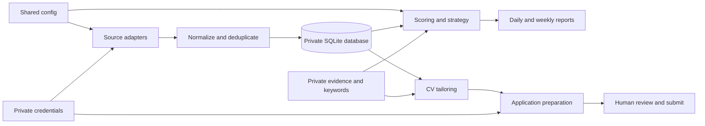

# Architecture

The repository has three executable packages:

- `job_bot` collects, normalizes, stores, scores, and reports jobs.
- `cv` turns verified evidence into tailoring guidance and document bundles.
- `application_bot` audits sessions and prepares supported application forms.

`private_paths.py` is the only canonical map for candidate-owned storage. Code
imports its constants rather than constructing private paths independently.
`JOBBOT_PRIVATE_DIR` changes the whole private root.

## Configuration layers

The public entry point composes small versioned files with ordered `includes`.
Later mappings override earlier mappings. Named lists can be changed through
validated `patches`, so a local override need not copy the entire source list.

The private layer contains candidate facts, evidence, credentials, browser
state, databases, reports, screenshots, and generated documents. JSON Schemas
document the maintained files; `jobbot-private check` adds semantic and
cross-file checks that JSON Schema alone cannot express.

## Decision boundaries

Collection may read public endpoints or an explicitly configured authenticated
browser session. Scoring ranks evidence already in the database. CV generation
may only draw claims from the evidence and keyword profiles. Application
adapters may fill explicitly mapped facts and upload selected documents.

CAPTCHA, MFA, login recovery, ambiguous questions, and legal or demographic
answers are manual checkpoints. Final submission is outside the automation
boundary.

## Output model

Durable candidate output stays below `private_data/`:

- `database/` contains SQLite state.
- `outputs/job_bot/` contains daily, weekly, and source-health reports.
- `outputs/application_bot/` contains preparation reports and screenshots.
- `cv/reports/`, `cv/variants/`, and `cv/build/` contain tailoring and rendered
  documents.
- `browser/state/` and `browser/profiles/` contain reusable authenticated state.

Public tests use synthetic fixtures only. A release audit examines the files
Git would publish and rejects common secrets, personal markers, generated
documents, machine-specific absolute paths, and unexpected large files.

